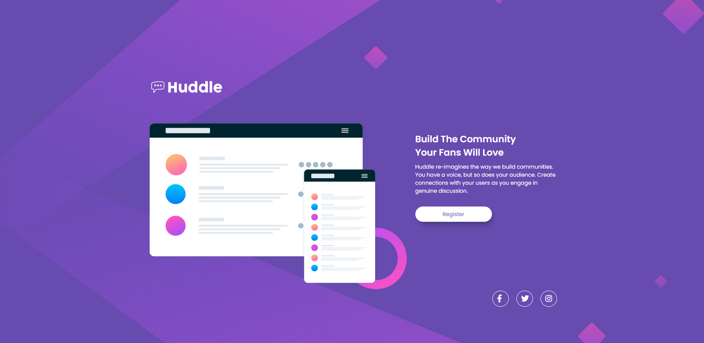

# Frontend Mentor - Huddle landing page with single introductory section solution

This is a solution to the [Huddle landing page](https://www.frontendmentor.io/challenges/huddle-landing-page-with-a-single-introductory-section-B_2Wvxgi0).

## Table of contents

- [Overview](#overview)
  - [The challenge](#the-challenge)
  - [Screenshot](#screenshot)
  - [Links](#links)
- [My process](#my-process)
  - [Built with](#built-with)
  - [What I learned](#what-i-learned)
  - [Useful resources](#useful-resources)
- [Author](#author)

## Overview

### The challenge

Users should be able to:

- View the optimal layout for the page depending on their device's screen size
- See hover states for all interactive elements on the page

### Screenshot

<details>
  <summary>💻 Desktop</summary>
  
</details>

<details>
  <summary>📱 Mobile</summary>
  
</details>

### Links

- Live Site URL: [Huddle landing page](https://your-live-site-url.com)

## My process

### Built with

- Semantic HTML5 markup
- CSS custom properties
- Flexbox
- Mobile-first workflow

### What I learned

In this project I learned how to modify a design based on its mobile version vs its desktop version, with the help of position and flexbox.

Some code snippets:

```html
<main class="background"></main>
```

```css
.background {
  background-image: url(./images/bg-desktop.svg);
  background-position: center center;
  background-repeat: no-repeat;
  background-size: cover;
  display: flex;
  flex-direction: row;
  justify-content: center;
  align-items: center;
  gap: 100px;
}
```

### Useful resources

- [Fontawesome](https://www.fontawesome.com) - I used their social media icons to complete my design.

## Author

- Frontend Mentor - [@themattfire](https://www.frontendmentor.io/profile/themattfire)
- Github - [@themattfire](github.com/themattfire)
